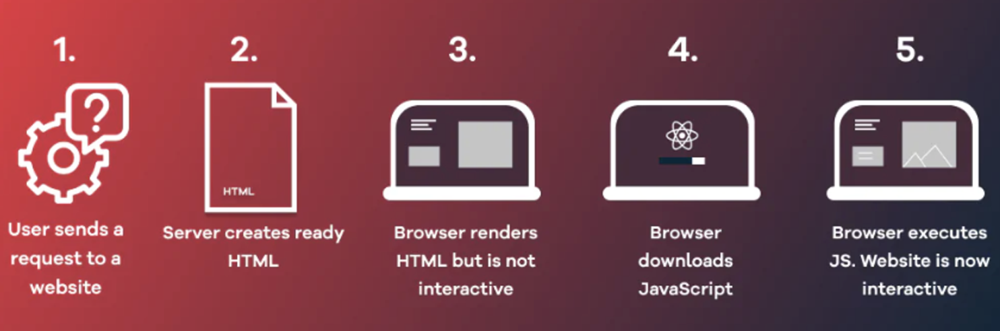
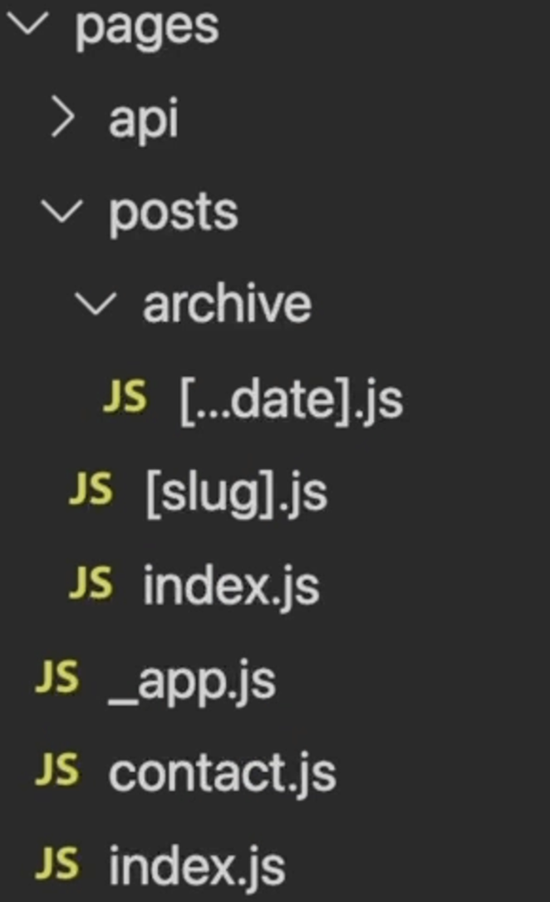
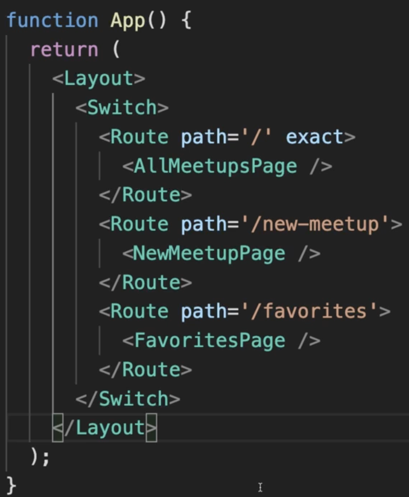

# [**Next.js**](https://nextjs.org/) 시작하기

## 1. Next.js 란 ?

> 프로덕션용 리액트 **풀스택**프레임 워크

- 🧐 *리액트는 왜 라이브러리인가요?*
    <aside>
    💡 리액트 = 프론트엔드 프로젝트에 추가되는 라이브러리
    즉, 클라이언트 측 자바스크립트 코드기 때문에
    사용자 인터페이스 부분인 컴포넌트, 상태, 프로퍼티 등에만 초점을 맞추고있음.
    그래서 리액트는 프레임워크가 아닌 라이브러리로 분류됨.
    
    일반적으로 대규모 React 프로젝트 구축시 라우팅, 인증 과정등을 돕는 라이브러리를 추가로 사용해야함.
    
    </aside>

- 🧐 *프레임워크와 라이브러리에 차이점*
    <aside>
    💡 규모 : 프레임워크 > 라이브러리
    프레임워크는 코드 작성법, 파일 구조화 등에 대한 명확한 규칙과 가이드라인 존재함.
    
    </aside>

## 2. 핵심기능

### 2.1 서버 사이드 페이지 사전 렌더링

#사용자경험개선 #SEO #검색엔진최적화

해당 페이지가 서버에서 미리 렌더링 되는 즉, 요청이 서버로 도달할때 데이터 페칭이 서버 측에서 처리되면 모든 내용을 포함한 페이지가 사용자와 검색엔진 사용자들에게 제공 가능함.

그로인해 사용자들은 더이상 페이지의 로딩 상태 (깜빡 거림)를 경험할 필요가 없고, 검색 엔진을 통해서도 페이지의 콘텐츠를 확인 할 수 있게 됨.(**검색 엔진 최적화**)

- 🧐 *서버 측 렌더링이란 ?*
    <aside>
    💡 클라이언트 측이 아닌 서버 측의 페이지 상에 렌더링되는 콘텐츠 처리를 의미함.
    
    </aside>

### 2.2 파일 기반 라우팅

#FileBased

React는 라우팅을 위해 별도의 코드를 따로 작성해야하지만

Next를 사용하면 파일과 폴더에 페이지와 라우트를 정의하게 되어있음.

<aside>
💡 이때 디렉토리 명은 반드시 pages로 설정되어야함.

</aside>

Next 라우팅 방법

React 라우팅 방법

추가적인 코드를 작성하지 않아도 되어 소스가 간결해지고, 중첩라우트 혹은 동적 매개변수 등 동적 라우팅 또한 모두 지원함

- 🧐 *라우팅 ?*
    <aside>
    💡 라우터의 역할
    사용자에게 여러 개의 페이지가 있는 듯한 착각을 불러일으키는 것
    
    라우터는 url 변경을 확인해 브라우저가 요청을 서버로 보내는 기본 동작을 방지하고, 대신 react를 통해 페이지 상에 다른 콘텐츠를 렌더링
    
    </aside>

### 2.3 풀스택

Next를 사용하면 백엔드 코드를 추가하는 작업도 수월하게 할 수 있음. 다시 말해 서버 측 사전 렌더링을 통한 클라이언트 측 코드뿐만 아니라 파일 시스템으로 작동하거나 데이터베이스에 전달로 전달되야하는 독립적인 백엔드 코드가 있는 프로젝트의 경우 Node.js를 통해 간단하게 백엔드 API를 추가 할 수 있음
