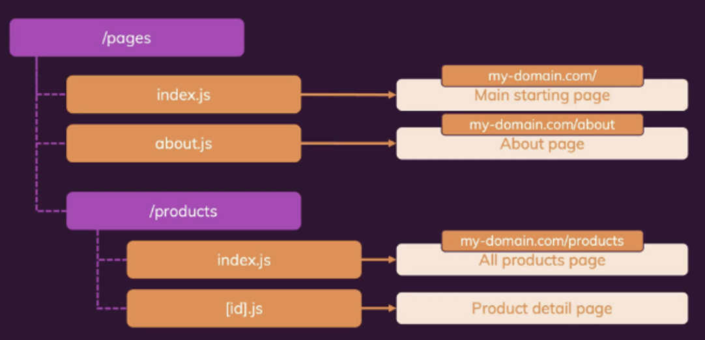
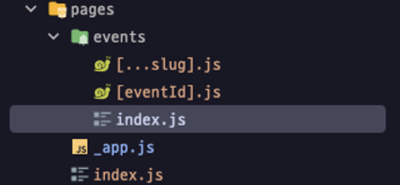
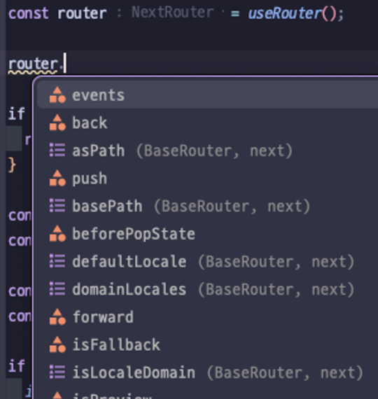

# 파일 기반 라우팅

### 1. 파일 기반 라우팅



/pages 폴더안에 일반 리액트 컴포넌트를 생성하면 Next가 설정된 폴더 구조로부터 프로젝트의 라우트를 도출하는 방법

- 🧐 왜 파일 기반 라우팅이 유용함?
    <aside>
    💡 file based routing 장점
    
    - 각 페이지는 프로젝트 디렉토리 구조 내에 별도의 파일로 표현되기에 애플리케이션 구조가 간단해지고 직관적임
    - next의 file based routing은 서버 사전 렌더링을 지원하기때문에 각 페이지는 해당 페이지에 대한 SEO관련 메타데이터와 함께 정적 생성 가능함
    - next는 페이지 별도 코드 스플리팅을 자동으로 수행, 즉 페이지가 필요한 경우에만 로드 되도록하여 초기 페이지 로드 시간을 단축, 성능을 향상 시킴
    - 동적 라우팅 지원
    - file based routing은 페이지에 오류가 있는 경우 미리 감지 후 개발자에게 알려주기 때문에 런타임 에러를 감지 할 수 있다.
    </aside>

## 2. 정적 라우트 파일

### 2.1 index 컴포넌트



Next에서 index는 특정한 파일명으로, 해당 파일을 경로로 인식하지 않고 주 컴포넌트로 불러와 주소 뒤에 아무것도 붙지 않음

```jsx
my-next-app/
├── pages/
│   ├── index.js   // my-next-app
│   ├── about.js.  // my-next-app/about
│   ├── contact.js // my-next-app/contact
│   └── ...
├── public/
│   ├── images/
│   ├── styles/
│   └── ...
└── ...
```

### 2.2 정적 라우트 파일 생성

```jsx
// index.js

function HomePage() {
  return <div>The Home Page</div>;
}

export default HomePage; // 컴포넌트를 반드시 반환해야 Next가 어떤 컴포넌트를 페이지로 렌더링해야 할지 알 수 있음
```

### 2.3 이름이 붙은 정적 라우트 파일 생성

```jsx
// about.js
// about은 index처럼 특수한 파일명이 아니기 때문에 경로 뒤에 about이 붙음

function AboutPage() {
  return <div>The About Page</div>;
}

export default AboutPage;
```

## 3. 중첩 경로 & 라우트

여러 세그먼트로 구성된 중첩 경로를 원할때 우측과 같이 pages 폴더를 구성할 수 있음.

```jsx
my-next-app/
├── pages/
│   ├── index.js
│   ├── about.js // my-next-app/about
│   ├── blog
│   │   ├── index.js // my-next-app/blog
│   │   ├── [slug].js
│   ├── user/
│   │   ├── index.js
│   │   ├── [id].js
│   └── ...
└── ...
```

## 4. 동적 경로 & 라우트

동적 라우팅을 위해선 파일명에 [ ]를 붙여야함. 대괄호 안에는 식별자를 기입. 식별자는 자유롭게 기입해도 되지만 반드시 식별자를 대괄호로 감싸야함.

```jsx
my-next-app/
├── pages/
│   ├── index.js
│   ├── about.js
│   ├── portfolio/
│   │   ├── index.js
│		│	  ├── list.js
│   │   ├── [projectid].js // my-next-app/project/123
│   └── ...
└── ...
```

```jsx
// PortfolioProjectPage.js

function porfolioPage() {
  return (
    <>
      <h1>The Portfolio Page</h1>
    </>
  );
}

export default porfolioPage;
```

위 코드처럼 파일명을 [porfolioPage].js 설정하고, 컴포넌트를 생성하면 **my-next-app/portfolio/** 주소 뒤에 어떤 숫자, 문자를 넣어도 해당 컴포넌트로 접근 가능하다.

어떤 값을 입력해도 주소가 유효한 이유는 [porfolioPage].js 라는 플레이스홀더에 그 안에 구체적인 값을 채워 넣는 방식으로 동작하기 때문이다.

여기서 주의할점은 my-next-app/project 뒤에 어떠한 값도 들어갈 수 있지만 list가 들어간다면 list 페이지로 이동해버린다. 동적파일보다 이미 정의된 정적 라우팅 페이지 파일이 우선되기 때문이다.

그렇기때문에 동적 경로를 사용할때는 플레이스홀더에 대한 고윳값으로 인식될 수 있는 값을 확인하면 그 값에 해당하는 값이 있는지 없는지 확인하는 과정을 추가해야한다.

<aside>
🤔 플레이스홀더로 우리가 얻을 수 있는건 무엇일까?

</aside>

가령 온라인 스토어 상품이나 블로그 게시글같이 여러 종류의 데이터를 불러와야하는 페이지를 생성할때 우리는 컴포넌트에 입력한 이름과 일치하는 구체적인 고윳값을 사용해 DB에 접근 가능해진다. 그럼 DB에서 패칭한 고유 데이터를 해당 컴포넌트에 적용해 화면을 출력할 수 있음

## 5. 동적 경로 세그먼트 데이터 추출

<aside>
🧐 그렇다면 사용자가 URL에 입력한 구체적은 고윳값에 접근하려면 어떻게 해야할까

</aside>

```jsx
// PortfolioProjectPage.js

import { useRouter } from "next/router";
// 1. Next가 제공하는 useRouter를 import

function porfolioPage() {
  const router = useRouter();
  // router 변수에 라우터 객체 반환

  console.log(router.query);
  // my-next-app/project/123 으로 접속 후
  // router.query를 콘솔 찍어보면
  // {projectid: '123'}
  // 동적 경로 세그먼트에 대한 고윳값에 접근 가능

  return <h1>The Portfolio Page</h1>;
}

export default porfolioPage;
```



router 객체가 제공하는 데이터 조각 및 메서드

만약 router.query로 얻은 프로퍼티가 DB에 저장된 객체 ID라면 router.query.projecid 라는 ID를 통해 백엔드 서버에 데이터 조각을 패칭할 수 있음

## 6. 중첩된 동적 라우트 & 경로 구축

```jsx
my-next-app/
├── pages/
│   ├── index.js
│   ├── about.js
│   ├── clients/
│   │   ├── index.js // client 목록 페이지
│		│	  └── [id].js
│   │        ├── [clientProjectid].js // client project 상세 페이지
│   │        └── index.js // client project 목록 페이지
│   └── ...
└── ...
```

위 처럼 디렉토리 구조를 구성하고 각 컴포넌트 생성 후 my-next-app/clients/ggang/123 으로 접근하면

```jsx
// [clientProjectid].js

import { useRouter } from "next/router";

function ClientProjectPage() {
  const router = useRouter();

  console.log(router.query); // router.query를 콘솔 찍어보면
  // {
  //		id: 'ggang',
  //		clientProjectid: '123'
  //	}
  return <h1>The Project of a Given Client</h1>;
}

export default ClientProjectPage;
```

중첩된 동적 라우트라도 고윳값에 접근 가능함.

## 7. Catch-All 라우트

Catch-All 라우트를 사용하면 어떤 경로이며 얼마나 많은 세그먼트를 갖는지에 상관없이 동일한 페이지를 불러올 수 있음.

필터링할때 유용함.

```jsx
my-next-app/
├── pages/
│   ├── index.js
│   ├── about.js
│   ├── blog
│		│	  └── [...slug].js
│   │        // 대괄호 안에 '...'을 붙여 파일을 생성 파일명은 자유지만 반드시 '...'을 붙여야함
│   │
│   └── ...
└── ...
```

위 처럼 디렉토리를 구성하고 my-next-app/blog/2023/10 으로 접근하면

```jsx
// [...slug].js

import { useRouter } from "next/router";

function BlogPostsPage() {
  const router = useRouter();

  console.log(router.query); // router.query를 콘솔 찍어보면
  // {slug : ['2023', '10']}
  // 처럼 배열을 가지게 됨

  return <h1>The Blog Posts</h1>;
}

export default BlogPostsPage;
```

## 8. Link 컴포넌트

```jsx
my-next-app/
├── pages/
│   ├── index.js
│   ├── about.js
│   ├── clients/
│   │   ├── index.js
│		│	  └── [id].js
│   │        ├── [clientProjectid].js
│   │        └── index.js
│   └── ...
└── ...
```

Next에서 제공하는 Link 태그를 사용하면 a 태그와 같은 동작을 구현 할 수 있음.

```jsx
// index.js

import Link from "next/link"; // Link import 시킴

function HomePage() {
  return (
    <>
      <h1>The Home Page</h1>
      <ul>
        <li>
          <Link href="/clients" replace>
            Clients
          </Link>
          // herf 속성에 이동하고 싶은 컴포넌트 주소 기입 // replace 프로퍼티 사용시
          새로운 페이지를 또 띄우지 않고 현재 페이지를 새 페이지로 바꿈. (뒤로가기
          막을 수 있음)
        </li>
      </ul>
    </>
  );
}

export default HomePage;
```

## 9. 동적 라우트 내비게이팅

```jsx
my-next-app/
├── pages/
│   ├── index.js
│   ├── about.js
│   ├── clients/
│   │   ├── index.js
│		│	  └── [id].js
│   │        ├── [clientProjectid].js
│   │        └── index.js
│   └── ...
└── ...
```

```jsx
// Clients.js

import Link from 'next/link'

function ClientsPage() {
	const clients = [{id : '1', name : 'kang'}, {id : '1', name : 'park'}]

	return (
		<>
			<h1>The Client Page</h1>
			<ul>
				{clients.map(client => (
					<li key={client.id}>
						<Link href=`/clients/${client.id}`>client.name</Link>
					</li>
				))}
			</ul>
		</>
	)
}

export default ClientsPage;
```

## 10. Link href 설정하는 다른 방법

next에서는 href에 문자열 대신 객체로 주소를 입력할 수 있음

```jsx
// Clients.js

import Link from "next/link";

function ClientsPage() {
  const clients = [
    { id: "1", name: "kang" },
    { id: "1", name: "park" },
  ];

  return (
    <>
      <h1>The Client Page</h1>
      <ul>
        {clients.map((client) => (
          <li key={client.id}>
            <Link
              href={{
                pathname: "/clients/[id]",
                query: { id: client.id },
              }}
            >
              client.name
            </Link>
          </li>
        ))}
      </ul>
    </>
  );
}

export default ClientsPage;
```

## 11. 커스텀 404 페이지

next에서는 index와 마찬가지로 pages 폴더 안 루트 계층에 있는 404라는 이름의 파일명을 특별하게 인식해 해당 URL로 접근 불가능 시 404 컴포넌트를 반환함

```jsx
my-next-app/
├── pages/
│   ├── index.js
│   ├── 404.js // 접근 불가능 시 해당 컴포넌트 반환
│   ├── clients/
│   │   ├── index.js
│		│	  └── [id].js
│   │        ├── [clientProjectid].js
│   │        └── index.js
│   └── ...
└── ...
```
