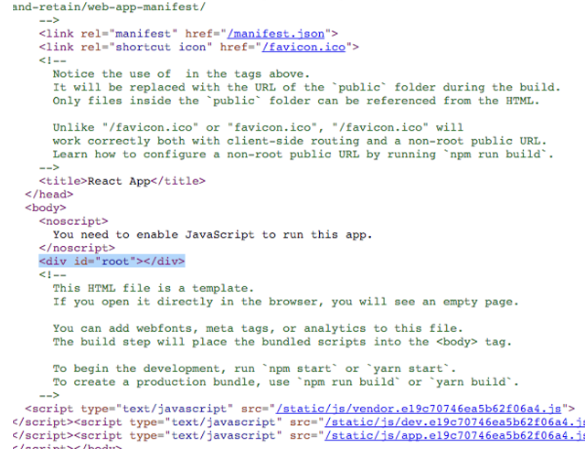

# 페이지 사전 렌더링 & 데이터 페칭

## 1. 기존 리액트 앱의 문제점

리액트 앱 실행 후 소스코드를 살펴보면 아래와 같이 리액트 앱이 렌더링 되는 `root div`가 텅 비어 있음.



아무 데이터도 포함하고 있지 않다는 것을 의미함. 여기에는 몇가지 단점이 존재함.

1. 사용자들이 데이터가 실질적으로 페이지에 로딩 될때까지 기다려야함.

   <aside>
   ✅ 백엔드 API를 이용해서 테이터를 페칭하는 실제 페이지에서는 데이터 로딩에 몇 초가 소요될 수 있어 지연이 발생함. 그렇기 때문에 데이터 페칭이 완료 될때까지 로딩화면 등으로 지연을 대체 하겠지만, **사용자 경험의 최적화라고 할 수 없음**

   </aside>

2. 검색엔진의 최적화 문제

   <aside>
   ✅ 검색 엔진이 있는 앱의 경우 우리가 만든 콘텐츠를 구글이 알아야 하는데, 위 이미지 처럼 **검색 엔진은 콘텐츠가 전혀 없는 데이터를 보게됨.**

   </aside>

## 2. Next가 페이지를 준비하고 사전 렌더링 하는 방식

### 2.1 페이지 사전 렌더링

- 사용자가 해당 페이지를 방문할때 Next는 **사전 렌더링된 페이지**를 반환
  ⇒ 리액트와 가장 큰 차이점
- 표준 리액트라면 빈 HTML파일과 모든 자바스크립트 코드가 표시되고, 자바스크립트 코드가 실행 되어야 스크린에 내용이 표시됨. 이 과정은 속도가 아주 빨라서 사용자에게 문제로 보이진 않지만 일반 DOM 구조 외의 필요한 데이터가 서버로 부터 로딩될 때는 시간이 소요될 수 있음.
- Next는 페이지 컴포넌트와 관련된 데이터를 가져와서 페이지를 렌더링해줌
  (서버가 해당 페이지와 관련된 데이터를 가져와 HTML로 변환)
  ⇒ 사전 렌더링 된 페이지가 페이지와 관련된 데이터와 초기 상태를 모두 포함
- 브라우저로 HTML 전송
- 사용자는 조기 페이지 로딩 시 바로 콘텐츠를 볼 수 있음 (검색 엔진 크롤러도 컨텐츠 확인 가능)
- 브라우저로 HTML을 전송할때 Next가 사전 렌더링된 페이지와 관련된 자바스크립트 코드를 다시 전송
  ⇒ 이 동작을 수화(Hydrate) 한다고 함
    <aside>
    ✅ **What's Hydrate?**
    
    클라이언트 측 자바스크립트 코드가 실행될 때 초기 상태와 데이터를 이미 사전 렌더링된 페이지에 적용하는 적용하는 과정을 의미.
    
    </aside>

- 브라우저에서 전송된 자바스크립트 코드가 실행되면, 이미 초기 상태 및 관련된 데이터가 사전 렌더링된 페이지에 존재하기 때문에 빠르게 SPA로 돌아갈 수 있음.
    <aside>
    ✅ **SPA로 돌아간다?**
    사전 렌더링은 오직 최초 로딩할 때만 영향을 미침. 페이지를 방문하면 로딩되는 첫 번째 페이지가 사전 렌더링 되는거임. 그래서 페이지의 수화, 즉 재전송된 자바스크립트 코드는 사전 렌더링된 페이지를 대체하게 되고 이것에 대한 작업들은 리액트가 수행하게 되면서 첫 번째 렌더링이 끝나고 나면 다시 SPA로 돌아감.
    
    </aside>

### 2.2 페이지 사전 렌더링 방식

1. **Static Generation (권장)**
2. Server-side Rendering

### 2.3 Static Generation와 Server-side Rendering 차이

- 정적 생성은 빌드되는 동안 모든 페이지가 사전 생성됨. (배포 전 모든 페이지 완성)
- 서버 사이드 렌더링의 경우 배포 후 요청이 서버까지 오는 그때 페이지를 생성함.

## 3. getStaticProps를 통한 정적 생성

### 3.1 정적 생성의 개념

- 빌드 하는 동안 페이지를 사전 생성
  ⇒ 서버 사이드에서 실행되는 코드를 빌드 타임에 실행
- 배포 완료 후 사전 구축된 페이지는 서버나 앱을 실행 시키는 CDN을 통해 캐시로 저장
    <aside>
    ✅ **CDN?**
    빌드 타임에 생성된 페이지는 정적 HTML로 저장되는데, 이 파일들이 CDN을 통해 사용자에게 빠르게 전달된다. 그렇다면 CDN이란 뭐고, 어떻게 빠르게 전달 할 수 있을까 ?
    
    CDN은 웹 컨텐츠를 더 빠르게 전달하기 위한 서비스로, 웹 컨텐츠를 전송하고 제공하기 위한 특수한 종류의 네트워크다. 사용자가 웹 페이지를 요청할 때, 가장 가까운 CDN 서버에서 사전에 구축된 페이지를 동적으로 생성하는 대신 복사본을 제공하기 때문에 페이지 로딩 시간이 단축되어 빠르게 전달 가능하다. 여기서 복사본을 저장하는 것은 CDN의 주요 기능 중 하나이며, 캐시(데이터나 콘텐츠의 복사본을 저장, 사용하는 메커니즘)된다 라고 표현한다.
    
    </aside>

- 캐시로 저장되었기 때문에 즉시 입력 요청이 실행 될 수 있음

### 3.2 사전 렌더링 페이지에 대한 데이터 지정하기

정적 생성된 웹 페이지에 어떤 데이터가 포함되어야하는지 지정하는 과정이 필요한데, Next에서는 해당 과정을 위해 **getStaticProps** 라는 특수한 함수를 제공한다.

### 3.3 getStaticProps 함수 사용 조건

1. page 컴포넌트 내부에 존재 해야함
2. page 컴포넌트는 반드시 pages 폴더 내부에 위치시켜야함
3. 컴포넌트 내부에서 비동기 함수를 가져와야 하는대 그때 반드시 함수 이름은 `getStaticProps` 여야함

   ```jsx
   export async function getStaticProps(context) {
     {
       /* ... */
     }
   }
   ```

4. 반드시 `export` 해야함

### 3.4 getStaticProps 함수 특징

1.  서버 사이드에서만 실행되는 모든 코드를 실행 할 수 있음

    <aside>
    ✅ **서버에서 실행되는 코드**

    웹 서버, 백엔드 서버, 데이터베이스 서버 및 다른 서버 측 리소스와 상호 작용하거나 처리하는 코드

    </aside>

2.  클라이언트에게 재전송 되지 않음
    ⇒ 함수 내 코드는 클라이언트가 볼 수 X (ex.데이터베이스 크리덴셜을 포함하는 경우)
    <aside>
    ✅ **Database credentials**

        데이터 베이스 시스템에 접근하고 상호 작용하기 위한 인증 정보로 아래와 같은 정보로 구성됨

        1. 사용자 이름
        2. 암호
        3. 호스트 또는 연결 정보
        4. 포트
        5. 기타 인증 및 권한 정보

        </aside>

### 3.5 getStaticProps 사용해보기

```jsx
// index.js << pages 폴더 안에 생성

function HomePage(props) {
  const { products } = props;
  return (
    <ul>
      {products.map((product) => (
        <li key={product.id}>{product.title}</li>
      ))}
    </ul>
  );
}

// HomePage 컴포넌트를 사전 렌더링 하기 전 프리페치 해야하는 데이터를 아래 함수내에 정의
// 컴포넌트에 대한 프로퍼티를 준비하는 역할 => HomePage 컴포넌트의 props 준비
// 그렇기 때문에 컴포넌트 생성 함수보다 먼저 실행됨
export async function getStaticProps() {
  return {
    // 객체를 반환
    props: {
      // props의 키의 데이터는 자유롭게 설정 가능하지만 반드시 객체여야함.
      products: [
        { id: 1, title: "product1" },
        { id: 2, title: "product2" },
      ],
    },
  };
}

export default HomePage;
```

### 3.6 서버 사이드 코드 실행 및 Filesystem 사용

```jsx
// index.js << pages 폴더 안에 생성

import path from "path";
import fs from "fs/promises";
// node.js로부터 파일 시스템 모듈 임포트.
// js(브라우저 측)가 파일시스템에 접근 할 수 없기 때문에 클라이언트 사이드에서 fs 작업 불가
// next에서는 getStaticProps 혹은 getServerSideProps에서만 쓰이는 import인지 확인하고
// 클라이언트 사이드 번들에서는 해당 import를 제거

function HomePage(props) {
  const { products } = props;
  return (
    <ul>
      {products.map((product) => (
        <li key={product.id}>{product.title}</li>
      ))}
    </ul>
  );
}

export async function getStaticProps() {
  const filePath = path.join(process.cwd(), data, "dummy-data.json");
  const jsonData = await fs.readFile(filePath);
  const data = JSON.parse(jsonData);

  return {
    props: {
      products: data.products,
    },
  };
}

export default HomePage;
```

- 🧐 자바스크립트가 브라우저 측에서 파일 시스템에 접근 못하는 이유
    <aside>
    ✅ 자바스크립트가 브라우저 측에서 파일 시스템에 접근 하지 못하는 이유
    
    1. **보안:** 브라우저 환경에서의 보안은 사용자의 개인 정보와 시스템을 보호하기 위해 필수적. 파일 시스템 접근을 허용하면 악의적인 코드가 사용자의 파일에 접근하거나 변경할 수 있으며, 그로 인한 보안 문제가 발생할 수 있음.
    2. **프라이버시:** 사용자의 개인 파일과 데이터는 민감한 정보를 포함할 수 있으며, 이를 외부 스크립트가 자유롭게 열람하거나 수정하면 사용자의 프라이버시가 침해됨.
    3. **일관성:** 파일 시스템은 운영 체제 및 브라우저 간에 다양한 형식과 구조로 다를 수 있으며, 이로 인해 표준화된 방법으로 접근하기 어려운 경우가 많음.
    </aside>

### 3.7 증분 정적 생성(ISR: Incremental Static Generation) 활용

```json
// dummy-data.js

{
  "products": [
    { "id": "p1", "title": "Product 1", "description": "This is product 1" },
    { "id": "p2", "title": "Product 2", "description": "This is product 2" },
    { "id": "p3", "title": "Product 3", "description": "This is product 3" },
    { "id": "p4", "title": "Product 4", "description": "This is product 4" } << new !! ✨
  ]
}
```

products에 새로운 item이 추가된다면 해당 수정건을 반영하기 위해 새로 빌드하고 배포해야한다. 블로그 같이 자주 데이터에 변경이 일어나지 않는 경우엔 새로운 포스팅이 업데이트 될때만 빌드하면 되지만 데이터가 자주 변경되는 사이트의 경우엔 자주 빌드하고 자주 배포해야하는 문제가 생김.

이럴때 우리는 `ISR`을 사용해 해당 문제를 해결할 수 있음.

`getStaticProps` 함수는 `next buile`, 즉 스크립트로 실행되는데 꼭 이때만 실행되는 것은 아니다.

방금 말한 `ISR`을 사용해 페이지를 빌드할때 정적으로 한 번만 실행하는 것이 아니라 배포 후에도 재배포 없이 계속 업데이트 시킬 수 있음.

방법은 X초마다 주어진 페이지를 재배포 하도록 설정하는 것임.

```jsx
// index.js

import path from "path";
import fs from "fs/promises";

function HomePage(props) {
  const { products } = props;
  return (
    <ul>
      {products.map((product) => (
        <li key={product.id}>{product.title}</li>
      ))}
    </ul>
  );
}

export async function getStaticProps() {
  const filePath = path.join(process.cwd(), data, "dummy-data.json");
  const jsonData = await fs.readFile(filePath);
  const data = JSON.parse(jsonData);

  return {
    props: {
      products: data.products,
    },
    // revalidate 라는 key 추가를 통해 몇초마다 재배포 할 것인지 정의 할 수 있음
    // value로는 페이지를 재생성할때까지 기다려야하는 시간을 초단위로 기입해 준다
    revalidate: 10,
  };
}

export default HomePage;
```

### 3.8 getStaticProps 구성 옵션

```jsx
// index.js

import path from "path";
import fs from "fs/promises";

function HomePage(props) {
  const { products } = props;
  return (
    <ul>
      {products.map((product) => (
        <li key={product.id}>{product.title}</li>
      ))}
    </ul>
  );
}

// getStaticProps는 context라는 매개변수를 추가 할 수 있는데
// 이는 next에 의해 호출되고 인수를 받기 때문임
// context는 next로 실행 될 때, 페이지에 대한 추가 정보를 받는 매개변수임.
export async function getStaticProps(context) {
  const filePath = path.join(process.cwd(), data, "dummy-data.json");
  const jsonData = await fs.readFile(filePath);
  const data = JSON.parse(jsonData);

  // redirect key를 사용하면 사용자를 리다이렉션 시킬 수 있는대
  // destination value로 예외처리 상황에 사용자를 리다이렉션 시킬 주소를 기입함.
  if (!data) {
    return {
      redirect: {
        destination: "/no-data",
      },
    };
  }

  // notFound key는 value로 boolean 타입을 받으며
  // true로 설정 시 페이지가 404오류를 반환해 일반 페이지 대신 404 페이지를 반환함
  if (data.products.length === 0) {
    return { notFound: true };
  }

  return {
    props: {
      products: data.products,
    },
    revalidate: 10,
  };
}

export default HomePage;
```

## 4. 동적 매개변수

3.8 index.js 에서 리스트 항목을 누르면 해당 아이템에 대한 디테일 페이지로 이동한다고 가정해보자.

```json
// dummy-data.js

{
  "products": [
    { "id": "p1", "title": "Product 1", "description": "This is product 1" },
    { "id": "p2", "title": "Product 2", "description": "This is product 2" },
    { "id": "p3", "title": "Product 3", "description": "This is product 3" }
  ]
}
```

`Link` 태그를 가져와 동적으로 주소를 생성해주고

```jsx
// index.js

import path from "path";
import fs from "fs/promises";
import Link from "next/link";

function HomePage(props) {
  const { products } = props;
  return (
    <ul>
      {products.map((product) => (
        <li key={product.id}>
          // 주소 생성
          <Link href={`/${product.id}`}>{product.title}</Link>
        </li>
      ))}
    </ul>
  );
}

export async function getStaticProps(context) {
  const filePath = path.join(process.cwd(), data, "dummy-data.json");
  const jsonData = await fs.readFile(filePath);
  const data = JSON.parse(jsonData);

  if (!data) {
    return {
      redirect: {
        destination: "/no-data",
      },
    };
  }

  if (data.products.length === 0) {
    return { notFound: true };
  }

  return {
    props: {
      products: data.products,
    },
    revalidate: 10,
  };
}

export default HomePage;
```

detail 컴포넌트를 아래와 같이 생성해보자.

이때 전체 항목을 표출 하는 것이 아닌 선택된 항목의 정보만 표출해야되기 때문에 동적 세그먼트 값을 추출해 전체 리스트에서 고윳값과 일치하는 항목을 찾아야한다.

항목을 찾기 위해 `getStaticProps` 함수의 매개변수 **`context`**를 사용 할 수 있는데, 방법은 아래 코드와 같다.

```jsx
// [pid].js << pages 폴더 안에 생성

import path from "path";
import fs from "fs/promises";
import Link from "next/link";

function ProductDetailPage(props) {
  const { loadedData } = props;
  return (
    <>
      <h1>{loadedData.title}</h1>
      <p>{loadedData.description}</p>
    </>
  );
}

export async function getStaticProps(context) {
  // context 매개 변수를 통해 경로상의 동적 세그먼트에 대한 구체적인 값을 알 수 있음
  const { params } = context;
  const productId = params.pid;

  const filePath = path.join(process.cwd(), data, "dummy-data.json");
  const jsonData = await fs.readFile(filePath);
  const data = JSON.parse(jsonData);

  const product = data.products.find((product) => product.id === productId);

  return {
    props: {
      loadedData: product,
    },
  };
}

export default ProductDetailpage;
```

- `useRouter`로 `query`값을 가져오면 안되나요?
    <aside>
    ✅ 컴포넌트 내부의 useRouter를 사용해서 query 값에 접근하고 서버로 부터 해당 값을 가지고 있는 데이터를 요청할 수 있지만, 해당 과정은 브라우저에서 일어난다. 
    getStaticProps() 로 페이지를 사전 렌더링 하게 되면 서버에서 동작하기 때문에, 컴포넌트 내부의 useRouter를 사용하는 것이 아닌 getStaticProps()의 매개변수 context로 동적 경로 세그먼트에 엑세스 해야한다.
    
    </aside>

여기까지 구현 후 리스트 아이템을 클릭하면 아래와 같은 에러가 발생한다


왜 에러가 나는지 고민하다보면 두가지 떠올라야 할 것이 있음

바로 넥스트는 **모든 페이지를 사전 생성**한다는 것임.

그리고 동적 페이지는 **그렇지 않다는 것**.

<aside>
✅ **왜 동적 페이지는 사전 렌더링 하지 않을까?**

페이지로 연결되있는 동적 세그먼트가 있는 경우 넥스트의 기본 동작으로 페이지를 사전 생성하지 않음.
왜냐하면 해당 페이지는 하나가 아닌 결국 여러 페이지로 이루어지 때문임.

예제 처럼 HTML 구조는 같고 데이터만 다르게 구성된 여러개의 페이지가 존재하게 된다.

그렇기 때문에 넥스트는 **얼마나 많은 페이지가 존재할지 예측할 수 없기 때문에** 동적 페이지에 대해선 사전 생성하지 않는다

</aside>

그렇기 때문에 동적 생성하지 않는 페이지에 `getStaticProps`를 사용해 에러가 발생한 것임.

해당 에러를 해결하기 위해선 넥스트에게 동적 페이지에서 어떤 인스턴스가 사전 생성되야하는지, 어떤 [id] 값이 필요한지, 어떤 동적 세그먼트 값을 사용할 수 있는지,어떤 값에 대한 페이지가 사전 생성 되어야 하는지 등의 더 많은 정보를 제공해야함.

제공하는 방법은 비동기 함수 `getStaticPaths()` 를 사용하는 것이다.

### 4.1 동적 페이지를 위한 getStaticPaths

`getStaticProps`와 마찬가지로 페이지 컴포넌트 파일에만 추가할 수 있는 비동기 함수이며, 반드시 `export` 해야한다.

```jsx
// [pid].js << pages 폴더 안에 생성

import path from "path";
import fs from "fs/promises";
import Link from "next/link";

function ProductDetailPage(props) {
  const { loadedData } = props;
  return (
    <>
      <h1>{loadedData.title}</h1>
      <p>{loadedData.description}</p>
    </>
  );
}

export async function getStaticProps(context) {
  // context 매개 변수를 통해 경로상의 동적 세그먼트에 대한 구체적인 값을 알 수 있음
  const { params } = context;
  const productId = params.pid;

  const filePath = path.join(process.cwd(), data, "dummy-data.json");
  const jsonData = await fs.readFile(filePath);
  const data = JSON.parse(jsonData);

  const product = data.products.find((product) => product.id === productId);

  return {
    props: {
      loadedData: product,
    },
  };
}

// getStaticPaths 함수의 목표 === 동적 페이지의 어떤 인스턴스를 생성할 지 Next에게 알리는 것
export async function getStaticPaths() {
  return {
    paths: [
      // 여러개의 params 가 올 수 있지만 key값은 무조건 고윳값이여야함.
      { params: { pid: "p1" } },
      { params: { pid: "p2" } },
      { params: { pid: "p3" } },
    ],
  };
}

export default ProductDetailpage;
```

### 4.2 fallback

만약 p1, p2, p3 중 ‘p1’을 제외한 나머지 페이지들은 사용자가 거의 방문하지 않는 페이지라면 모든 페이지를 사전 렌더링 할 필요 없다.

**_시간도 오래 걸리고, 자원 낭비이기 때문이다._**

그렇다면 아래 추가한 params 중 ‘p1’을 제외한 나머지 값을들 지우고 **`fallback key`**를 추가해보자.

```jsx
// [pid].js << pages 폴더 안에 생성

import path from "path";
import fs from "fs/promises";
import Link from "next/link";

function ProductDetailPage(props) {
  const { loadedData } = props;
  return (
    <>
      <h1>{loadedData.title}</h1>
      <p>{loadedData.description}</p>
    </>
  );
}

export async function getStaticProps(context) {
  const { params } = context;
  const productId = params.pid;

  const filePath = path.join(process.cwd(), data, "dummy-data.json");
  const jsonData = await fs.readFile(filePath);
  const data = JSON.parse(jsonData);

  const product = data.products.find((product) => product.id === productId);

  return {
    props: {
      loadedData: product,
    },
  };
}

export async function getStaticPaths() {
  return {
    paths: [{ params: { pid: "p1" } }],
    fallback: true,
  };
}

export default ProductDetailpage;
```

`fullback key`는 value로 3가지 값을 받을 수 있다.

1. `false` : 동적 라우팅을 사용하지 않는 옵션. 동적 라우팅 페이지를 미리 생성하지 않고 잘못된 경로로 접근 했을 시 404 오류로 처리한다
2. `true` : 존재하지 않는 경로로의 접근을 허용하며, 페이지를 사전 생성하는 것이 아닌 요청이 서버에 도달하는 순간 생성한다.

   ```jsx
   function ProductDetailPage(props) {
     const { loadedData } = props;

     if (!loadedData) {
       return <p>Loading...</p>;
     }

     return (
       <>
         <h1>{loadedData.title}</h1>
         <p>{loadedData.description}</p>
       </>
     );
   }

   {
     /* ... */
   }

   export async function getStaticPaths() {
     return {
       paths: [{ params: { pid: "p1" } }],
       // 이렇게 ‘p1’밖에 존재하지 않지만 ‘p2’, ‘p3’ 경로로 접근해도 오류가 없다.
       // 대신 사전 생성이 아닌, 요청이 서버에서 도달하는 시점에 요청에 따라 동적으로 페이지를 만들어 제공하기 때문에
       // 사용자는 이 과정에서 로딩중 등에 메세지를 볼 수 있다.
       fallback: true,
     };
   }
   ```

   - 링크 태그로 클릭해서 ‘p3’로 접근하면 로딩 페이지 없어도 에러가 안나는대요?
       <aside>
       ✅ Next.js에서의 동적 라우팅 및 **`fallback`** 동작에 따라 두 가지 접근 방식에 차이가 있을 수 있음
       
       - 링크 태그(예: 클릭 가능한 텍스트 또는 버튼)를 사용하여 페이지로 이동하면, 브라우저는 즉시 해당 페이지로 이동. 
       이것은 클라이언트 측에서 처리되며 빠르게 생성됩니다. 따라서 오류가 발생하지 않습니다.
       - 존재하지 않는 경로를 직접 URL을 입력하여 페이지로 이동할 때, 서버는 해당 페이지를 동적으로 생성해야 함. 클라이언트의 요청에 응답하는 과정인데, 때로는 페이지가 아직 완전히 생성되지 않은 경우가 있음. 특히 **`fallback: true`** 설정이 적용된 경우, 페이지가 아직 생성 중이더라도 브라우저에 표시하려고 시도하기 때문에 페이지가 없다는 에러를 발생한다. 그래서 로딩 페이지를 추가해줘야함
       </aside>

3. `‘blocking’`: 존재하지 않는 동적 경로의 접근을 허용하며, 요청이 서버 측에서 처리되어 페이지를 생성한다.

   ⇒ **클라이언트 측 처리 X, 서버 측 처리 O**
   이 경우엔 true로 설정할때 처럼 fullback을 확인할 필요가 없는데(로딩처리), 서버에서 **완전히 사전 생성되도록 Next가 기다리기 때문**이다.

### 4.3 동적으로 경로 로딩하기

하드코딩으로 `paths`를 설정해 둔 부분을 **동적**으로 바꿔보자.

```jsx
export async function getStaticPaths() {
  return {
    paths: [
      { params: { pid: "p1" } },
      { params: { pid: "p2" } },
      { params: { pid: "p3" } },
    ],
    fallback: true,
  };
}
```

```jsx
// [pid].js << pages 폴더 안에 생성

{
  /* ... */
}

async function getData() {
  const filePath = path.join(process.cwd(), data, "dummy-data.json");
  const jsonData = await fs.readFile(filePath);
  const data = JSON.parse(jsonData);
}

export async function getStaticProps(context) {
  const { params } = context;
  const productId = params.pid;

  const data = await getData();

  const product = data.products.find((product) => product.id === productId);

  if (!product) {
    return {
      notFound: true,
    };
  }

  return {
    props: {
      loadedData: product,
    },
  };
}

export async function getStaticPaths() {
  const data = await getData();

  const ids = data.products.map((product) => product.id);
  const pathWithParams = ids.map((id) => ({ params: { pid: id } }));

  return {
    paths: pathWithParams,
    fallback: true,
  };
}

export default ProductDetailpage;
```

## 5. 서버 사이드 렌더링을 위한 getServerSideProps

`ISR`이 있긴 하지만 결국 `getStaticProps` 와 `getStaticPaths`는 **들어오는 실제 요청에 접근 할 수 없음**

그래서 유입되는 모든 요청에 대한 페이지를 사전 렌더링 하기 위해서는 `getServerSideProps` 를 사용해야한다.

`getServerSideProps` 를 사용하게 되면 페이지가 요청될 때마다 서버에서 데이터를 가져오기 때문에 항상 최신 데이터를 표시 할 수 있다.

`getServerSideProps`는 `getStaticProps`와 `getStaticPaths`와 마찬가지로 비동기 함수이며 반드시 export 해야한다.

여기서 `getServerSideProps`와 `getStaticProps` 를 동시에 쓸 수 없다는 점에 유의해야한다.

```jsx
export async function getServerSideProps() {
  {
    /* ... */
  }
}
```

예시로 사용자 프로필을 보여주는 페이지에 `getServerSideProps`를 사용해보자

```jsx
// user-prorile.js

function UserProfilPage(props) {
  const { username } = props;
  return <h1>{username}</h1>;
}

// **getServerSideProps는 배포된 서버와 개발 서버에서만 실행됨**
// **여기서 context는 getStaticProps 처럼 매개변수 객체나 덜 중요한 부분에만 접근하는 것이 아님 << 중요한 차이 ✨**
// req 객체 전체에도 접근할 수 있음. 또한
// res 객체에 접근해 헤당 요청을 조정하거나, 헤더도 추가할 수 있음
export async function getServerSideProps(context) {
  const { params, req, res } = context;

  // 쿠키에서 회원 정보 읽기
  const cookies = parseCookies(req);
  const username = cookies.username || ""; // 쿠키에서 username 값 읽기

  // 회원 정보가 존재하지 않을 때, 로그인 또는 회원 정보 설정 페이지로 리다이렉트
  if (!username) {
    res.writeHead(302, { Location: "/login" });
    res.end();
  }

  return {
    props: {
      username,
    },
  };
}

export default UserProfilPage;
```

## 6. 클라이언트 사이드 데이터 페칭

Next로 개발을 하다보면 때로는 사전 렌더링 할 필요가 없거나 사전 렌더링을 할 수 없는 데이터를 다룰때가 있다.

여기서 사전 렌더링을 할 수 없는 데이터는 여러 의미를 가지고 있음.

1.  **갱신 주기가 잦은 데이터**

    가령 주식 데이터를 어떤 페이지에 표시하려고 할때 데이터가 매초마다 계속해서 변경된다면 프리페칭과 사전 렌더링을 하는 의미가 없어진다

2.  **특정 유저에게만 한정되는 데이터**

    온라인 쇼핑몰의 최근 주문 내역과 같은 데이터들인데, 계정에 접속해서 프로필 페이지에서 특정한 데이터를 열람해야 하는 경우 페이지를 사전 렌더링할 필요가 없다

3.  **데이터의 일부만 표시하는 경우**

    대시보드 페이지의 경우 모든 데이터를 한번에 불러오도록 하면 서버에서 대치보드 요청을 처리하는데 시간이 많이 소요된다.

    그렇기 때문에 개발 단계에서 이 페이지를 사전 렌더링 할 이유가 없음.

이러한 경우 그냥 클라이언트 측에서, 즉 리액트 앱 내의 API 인 `useEffect`나 `fetch`를 쓰는게 더 효율적이다,

## 7. useSWR

🔗 https://swr.vercel.app/ko

`useSWR`(stale-while-revalidate)은 Next 팀에서 개발한 리액트 훅인데, Next 프로젝트가 아니여도 사용할 수 있다.

```jsx
useSWR(<request-url>, (url) => fetch(url).then(res => res.json()))
```

<aside>
✅ **stale-while-revalidate**

"stale-while-revalidate"는 웹 캐시 관련 HTTP 헤더 지시어 중 하나로, 웹 페이지 또는 리소스의 캐싱 및 갱신을 조절하는 데 사용.
이 지시어는 페이지를 캐시한 동안 오래된 캐시된 버전을 사용하고 동시에 백그라운드에서 새로운 데이터를 가져와서 캐시를 갱신하는 방식으로 동작.

일반적으로 "stale-while-revalidate"은 웹 페이지나 리소스의 빠른 로딩을 보장하면서, 동시에 최신 데이터로 갱신되도록 하는 데 사용.
사용자에게 페이지 로딩 시간을 절약하고 빠르게 캐시된 내용을 표시하면서, 동시에 백그라운드에서 새로운 데이터를 가져오는 데 유용.

예를 들어, **사용자가 브라우저에서 웹 페이지를 열면 브라우저는 캐시된 페이지를 표시하고 동시에 서버에 새로운 페이지 데이터를 요청함.**

캐시된 페이지는 사용자에게 빠르게 표시되고, 동시에 서버에서 새로운 데이터를 가져와 캐시를 갱신함.

이렇게 하면 사용자는 즉시 페이지를 볼 수 있으며, 데이터는 백그라운드에서 갱신된다.

</aside>

이 훅은 HTTP 요청을 보낼 때 fetch API 를 사용하는데, 여기에는 여러가지 내장기능들이 있음. (캐싱 및 자동 유효성 재검사, 에러 시 요청 재시도..etc)

그리고 길게 코드 전체를 직접 작성하지 않아도 된다.

```bash
npm i swr
```

```jsx
import useSWR from "swr";

function UserProfile() {
  // useSWR 훅을 사용하여 데이터를 가져오기
  // 중첩 함수가 아니기 때문에 컴포넌트에 직접 사용해야함
  // 하나 이상의 인수로서 보낼 요청의 식별자가 필요한데, 일반적으로 그 요청의 URL이 필요함.
  // 여기서 식별자라고 부르는 이유는 이 훅이 같은 URL에 여러 요청을 한번에 묶어 보내기 때문임(특정 기간 동안 한번의 요청으로 전송)
  // 두번째 인수로 fetcher() 기본으로 넣어야함.

  // 이렇게 하면 컴포넌트가 로딩되면 URL로 요청이 전송됨
  // 그리고 훅으로 반환된 데이터로 작업이 가능해짐
  const { data, error } = useSWR("/api/user", fetcher);

  if (error) return <div>Error loading data</div>;
  if (!data) return <div>Loading...</div>;

  return (
    <div>
      <h1>User Profile</h1>
      <p>Name: {data.name}</p>
      <p>Email: {data.email}</p>
    </div>
  );
}

// 데이터를 가져오는 함수
const fetcher = (url) => fetch(url).then((res) => res.json());

export default UserProfile;
```
